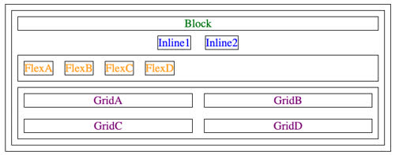

# **NOTES**

### *[README.md](/README.md)*

## Git
When working with git, your bread and butter is:
```
git pull
git add .
git commit
git push
```
## Web Servers
* Learned to assign an elastic ip address to server. Permanent ip is 18.205.101.148
* To remote in the server:
  ```
  ssh -i [key pair file] ubuntu@[ip address]
  ```
* To change permission on the file
  ```
  chmod 600 [file]
  ```
  * 600 is rw, 400 is r.

## DNS Servers
* Broken up into a root domain.
  ```
              -----root----
  [subdomain.]secondary.top
  ```
* DNS servers associate the text name with an IP address
* Two types of DNS
  * addres (A), maps IP onto domain name
  * canonical name (CNAME), maps one domain name onto another one.

### My Domain: gametracker.click

### My Elastic IP Address: 18.205.101.148

## Caddy
* Handles rotation of web certificates. Supports HTTPS
* Acts as a gateway and will redirect subdomain requests properly
* Serves up all static HTML, CSS< and JavaScript files
* HTML files:
    * Directory of files that Caddy servers up when request are made to the root or your web server.
 
## Push files to AWS server: ```./deployFiles.sh -k <yourpemkey> -h <yourdomain> -s simon```

## HTTPS
* Secure version of HTTP, data is encrypted and protected by TLS.
* Let's Encrypt is a non profit IETF ACME protocol to encrypt requests
* Update the caddy file to replace port :80 with your domain name, and where ever it says "yourdomain"
* This will make it defaul to port 443 which will use caddy as a gateway and use HTTPS

# Linux commands to know

| Commands | Effect                                                                      |
|----------|-----------------------------------------------------------------------------|
| pwd      | Print working directory                                                     |
| cd       | Change directory                                                            |
| ls       | List items in current directory                                             |
| vim      | Open Vim text editor                                                        |
| nano     | Open nano text editor                                                       |
| mkdir    | Make new directory                                                          |
| mv       | Move an item or directory (-r)                                              |
| rm       | Remove item or directory (-r)                                               |
| man      | Open manually of a command                                                  |
| ssh      | Securely remote into another machine                                        |
| ps       | List all currently working services                                         |
| wget     | Download from network with the option of downloading in the background (-b) |
| sudo     | Super User DO, prefix to run a command as an admin                          |
| chmod    | Change access mode of a file                                                |

# HTML (Hyper text markup language)

### Elements and tags
* Based of HTML document
```html
<html>
  <head>
    <title>My First Page</title>
  </head>
  <body>
    <main>
      <p>Hello world</p>
    </main>
  </body>
</html>
```
  * html represents top level page structure
  * Head represents the metadata of the page
  * body represents content structure
  * main element represents the main content structure, as opposed to headers and such.

### Attributes
* Every element and tag can have attributes.
```html
<p id="hello" class="greeting">Hello world</p>
```

### Hyperlinks
* Represented by a anchor tag ```<a href="https://gametracker.click">GameTracker</a>```

```html
<!DOCTYPE html>
<html lang="en">
  <body>
    <main>
      <h1>Hello world</h1>
      <p class="introduction">
        HTML welcomes you to the amazing world of
        <span class="topic">web programming</span>.
      </p>
      <p class="question">What will this mean to you?</p>
      <p class="assignment">Learn more <a href="instruction.html">here</a>.</p>
    </main>
  </body>
</html>
```

### Block vs. Inline
* A block tag sets the bounds of content, like \<p>
* An inline does <b>not</b> <span>disrupt</span> flow, like \<b> or \<span>


### Common HTML Tags
<table>
<thead>
<tr>
<th>element</th>
<th>meaning</th>
</tr>
</thead>
<tbody>
<tr>
<td><code>html</code></td>
<td>The page container</td>
</tr>
<tr>
<td><code>head</code></td>
<td>Header information</td>
</tr>
<tr>
<td><code>title</code></td>
<td>Title of the page</td>
</tr>
<tr>
<td><code>meta</code></td>
<td>Metadata for the page such as character set or viewport settings</td>
</tr>
<tr>
<td><code>script</code></td>
<td>JavaScript reference. Either a external reference, or inline</td>
</tr>
<tr>
<td><code>include</code></td>
<td>External content reference</td>
</tr>
<tr>
<td><code>body</code></td>
<td>The entire content body of the page</td>
</tr>
<tr>
<td><code>header</code></td>
<td>Header of the main content</td>
</tr>
<tr>
<td><code>footer</code></td>
<td>Footer of the main content</td>
</tr>
<tr>
<td><code>nav</code></td>
<td>Navigational inputs</td>
</tr>
<tr>
<td><code>main</code></td>
<td>Main content of the page</td>
</tr>
<tr>
<td><code>section</code></td>
<td>A section of the main content</td>
</tr>
<tr>
<td><code>aside</code></td>
<td>Aside content from the main content</td>
</tr>
<tr>
<td><code>div</code></td>
<td>A block division of content</td>
</tr>
<tr>
<td><code>span</code></td>
<td>An inline span of content</td>
</tr>
<tr>
<td><code>h&lt;1-9&gt;</code></td>
<td>Text heading. From h1, the highest level, down to h9, the lowest level</td>
</tr>
<tr>
<td><code>p</code></td>
<td>A paragraph of text</td>
</tr>
<tr>
<td><code>b</code></td>
<td>Bring attention</td>
</tr>
<tr>
<td><code>table</code></td>
<td>Table</td>
</tr>
<tr>
<td><code>tr</code></td>
<td>Table row</td>
</tr>
<tr>
<td><code>th</code></td>
<td>Table header</td>
</tr>
<tr>
<td><code>td</code></td>
<td>Table data</td>
</tr>
<tr>
<td><code>ol,ul</code></td>
<td>Ordered or unordered list</td>
</tr>
<tr>
<td><code>li</code></td>
<td>List item</td>
</tr>
<tr>
<td><code>a</code></td>
<td>Anchor the text to a hyperlink</td>
</tr>
<tr>
<td><code>img</code></td>
<td>Graphical image reference. Specify src tag.</td>
</tr>
<tr>
<td><code>dialog</code></td>
<td>Interactive component such as a confirmation</td>
</tr>
<tr>
<td><code>form</code></td>
<td>A collection of user input</td>
</tr>
<tr>
<td><code>input</code></td>
<td>User input field</td>
</tr>
<tr>
<td><code>audio</code></td>
<td>Audio content</td>
</tr>
<tr>
<td><code>video</code></td>
<td>Video content</td>
</tr>
<tr>
<td><code>svg</code></td>
<td>Scalable vector graphic content</td>
</tr>
<tr>
<td><code>iframe</code></td>
<td>Inline frame of another HTML page</td>
</tr>
</tbody>
</table>

### HTML Input

<table>
<thead>
<tr>
<th>Element</th>
<th>Meaning</th>
<th>Example</th>
</tr>
</thead>
<tbody>
<tr>
<td><code>form</code></td>
<td>Input container and submission</td>
<td><code>&lt;form action="form.html" method="post"&gt;</code></td>
</tr>
<tr>
<td><code>fieldset</code></td>
<td>Labeled input grouping</td>
<td><code>&lt;fieldset&gt; ... &lt;/fieldset&gt;</code></td>
</tr>
<tr>
<td><code>input</code></td>
<td>Multiple types of user input</td>
<td><code>&lt;input type="" /&gt;</code></td>
</tr>
<tr>
<td><code>select</code></td>
<td>Selection dropdown</td>
<td><code>&lt;select&gt;&lt;option&gt;1&lt;/option&gt;&lt;/select&gt;</code></td>
</tr>
<tr>
<td><code>optgroup</code></td>
<td>Grouped selection dropdown</td>
<td><code>&lt;optgroup&gt;&lt;option&gt;1&lt;/option&gt;&lt;/optgroup&gt;</code></td>
</tr>
<tr>
<td><code>option</code></td>
<td>Selection option</td>
<td><code>&lt;option selected&gt;option2&lt;/option&gt;</code></td>
</tr>
<tr>
<td><code>textarea</code></td>
<td>Multiline text input</td>
<td><code>&lt;textarea&gt;&lt;/textarea&gt;</code></td>
</tr>
<tr>
<td><code>label</code></td>
<td>Individual input label</td>
<td><code>&lt;label for="range"&gt;Range: &lt;/label&gt;</code></td>
</tr>
<tr>
<td><code>output</code></td>
<td>Output of input</td>
<td><code>&lt;output for="range"&gt;0&lt;/output&gt;</code></td>
</tr>
<tr>
<td><code>meter</code></td>
<td>Display value with a known range</td>
<td><code>&lt;meter min="0" max="100" value="50"&gt;&lt;/meter&gt;</code></td>
</tr>
</tbody>
</table>

### Input tag types
<table>
<thead>
<tr>
<th>Type</th>
<th>Meaning</th>
</tr>
</thead>
<tbody>
<tr>
<td>text</td>
<td>Single line textual value</td>
</tr>
<tr>
<td>password</td>
<td>Obscured password</td>
</tr>
<tr>
<td>email</td>
<td>Email address</td>
</tr>
<tr>
<td>tel</td>
<td>Telephone number</td>
</tr>
<tr>
<td>url</td>
<td>URL address</td>
</tr>
<tr>
<td>number</td>
<td>Numerical value</td>
</tr>
<tr>
<td>checkbox</td>
<td>Inclusive selection</td>
</tr>
<tr>
<td>radio</td>
<td>Exclusive selection</td>
</tr>
<tr>
<td>range</td>
<td>Range limited number</td>
</tr>
<tr>
<td>date</td>
<td>Year, month, day</td>
</tr>
<tr>
<td>datetime-local</td>
<td>Date and time</td>
</tr>
<tr>
<td>month</td>
<td>Year, month</td>
</tr>
<tr>
<td>week</td>
<td>Week of year</td>
</tr>
<tr>
<td>color</td>
<td>Color</td>
</tr>
<tr>
<td>file</td>
<td>Local file</td>
</tr>
<tr>
<td>submit</td>
<td>button to trigger form submission</td>
</tr>
</tbody>
</table>

Many input types have built in validation, but you can also specify additional restrictions.

### HTML Media
* img, audio, and video are all external media that need a source specified, and should always include an alt tag describing the media.
  * audio and video can have control tag to allow user to control playback, can also include loop and autoplay tags.
* svg and canvas both contain code to render a visual image. This image can be animated.


# CSS (Cascading Style Sheets)

Helps the developer build complex designs and responsive dynamic content. ALlows changing the layout of the page based on device and orientation

## Components
* ***Rulesets (Rules)*** : 
  * ***Selector*** : Selects elements to apply rule to.
    * ***Declaration*** :
      * ***Property*** : Property of element
      * ***Value*** : Value to give property

```css
p {
  font-family: sans-serif;
  font-size: 2em;
  color: navy;
  text-shadow: 3px 3px 1px #cccccc;
}
```

### Associate HTML and CSS
  * style attribute of HTML element
    ```html
    <p style="color:green">CSS</p>
    ```
  * style HTML element to define CSS rules
    ```html
    <head>
      <style>
        p {
          color: green;
        }
      </style>
    </head>
    <body>
      <p>CSS</p>
    </body>
    ```
  * HTML Link element to create a hyperlink reference to an external file containing CSS rules.
    ```html
    <link rel="stylesheet" href="styles.css" />
    ```

### Cascading
Elements will inherit the style of their parents, but lower level styling will override inherited styles.

### Box Model
Everythign is a box in CSS. It's boxes within boxes.
* The inner most box actually holds the content. Text or image.
* The next box contains the padding. Usually the background color.
* Next box is the border, which has color, thicknexx, and line style.
* Margin is the last box. External element of white space.

## Selectors

### Element Selectors
* select an element and make all elements in that document follow that rule.
  ```css
  body {
    font-family: sans-serif;
  }

  h1 {
    border-bottom: thin black solid;
  }

  section {
    background: #eeeeee;
    padding: 0.25em;
    margin-bottom: 0.5em;
  }
  ```

### Combinators
  * Selector that applies to given combination.
  <table>
<thead>
<tr>
<th>Combinator</th>
<th>Meaning</th>
<th>Example</th>
<th>Description</th>
</tr>
</thead>
<tbody>
<tr>
<td>Descendant</td>
<td>A list of descendants</td>
<td><code>body section</code></td>
<td>Any section that is a descendant of a body</td>
</tr>
<tr>
<td>Child</td>
<td>A list of direct children</td>
<td><code>section &gt; p</code></td>
<td>Any p that is a direct child of a section</td>
</tr>
<tr>
<td>General sibling</td>
<td>A list of siblings</td>
<td><code>p ~ div</code></td>
<td>Any p that has a div sibling</td>
</tr>
<tr>
<td>Adjacent sibling</td>
<td>A list of adjacent sibling</td>
<td><code>p + div</code></td>
<td>Any p that has an adjacent div sibling</td>
</tr>
</tbody>
</table>

### Class Selector
Apply to only elements with the given specification
```css
.summary {
  font-weight: bold;
}
```
Can also apply to a specific element with that class
```css
p.summary {
  font-weight: bold;
}
```

### ID Selectors
Reference the ID of an element. Ideally HTML IDs are unique so the specification can be specific.
```css
#physics {
  border-left: solid 1em purple;
}
```

### Attribute Selector
Select elements based on their attributes.
  * Where href="./cow.png"

Can include wild cards to match some text
  * Where href*="https://"

```css
p[class='summary'] {
  color: red;
}
```

### Pseudo Selectors
Select based on positional relationship, mouse interactions, etc.
```css
section:hover {
  border-left: solid 1em purple;
}
```

## Declarations

### Properties
<table>
<thead>
<tr>
<th>Property</th>
<th>Value</th>
<th>Example</th>
<th>Discussion</th>
</tr>
</thead>
<tbody>
<tr>
<td>background-color</td>
<td>color</td>
<td><code>red</code></td>
<td>Fill the background color</td>
</tr>
<tr>
<td>border</td>
<td>color width style</td>
<td><code>#fad solid medium</code></td>
<td>Sets the border using shorthand where any or all of the values may be provided</td>
</tr>
<tr>
<td>border-radius</td>
<td>unit</td>
<td><code>50%</code></td>
<td>The size of the border radius</td>
</tr>
<tr>
<td>box-shadow</td>
<td>x-offset y-offset blu-radius color</td>
<td><code>2px 2px 2px gray</code></td>
<td>Creates a shadow</td>
</tr>
<tr>
<td>columns</td>
<td>number</td>
<td><code>3</code></td>
<td>Number of textual columns</td>
</tr>
<tr>
<td>column-rule</td>
<td>color width style</td>
<td><code>solid thin black</code></td>
<td>Sets the border used between columns using border shorthand</td>
</tr>
<tr>
<td>color</td>
<td>color</td>
<td><code>rgb(128, 0, 0)</code></td>
<td>Sets the text color</td>
</tr>
<tr>
<td>cursor</td>
<td>type</td>
<td><code>grab</code></td>
<td>Sets the cursor to display when hovering over the element</td>
</tr>
<tr>
<td>display</td>
<td>type</td>
<td><code>none</code></td>
<td>Defines how to display the element and its children</td>
</tr>
<tr>
<td>filter</td>
<td>filter-function</td>
<td><code>grayscale(30%)</code></td>
<td>Applies a visual filter</td>
</tr>
<tr>
<td>float</td>
<td>direction</td>
<td><code>right</code></td>
<td>Places the element to the left or right in the flow</td>
</tr>
<tr>
<td>flex</td>
<td></td>
<td></td>
<td>Flex layout. Used for responsive design</td>
</tr>
<tr>
<td>font</td>
<td>family size style</td>
<td><code>Arial 1.2em bold</code></td>
<td>Defines the text font using shorthand</td>
</tr>
<tr>
<td>grid</td>
<td></td>
<td></td>
<td>Grid layout. Used for responsive design</td>
</tr>
<tr>
<td>height</td>
<td>unit</td>
<td><code>.25em</code></td>
<td>Sets the height of the box</td>
</tr>
<tr>
<td>margin</td>
<td>unit</td>
<td><code>5px 5px 0 0</code></td>
<td>Sets the margin spacing</td>
</tr>
<tr>
<td>max-[width/height]</td>
<td>unit</td>
<td><code>20%</code></td>
<td>Restricts the width or height to no more than the unit</td>
</tr>
<tr>
<td>min-[width/height]</td>
<td>unit</td>
<td><code>10vh</code></td>
<td>Restricts the width or height to no less than the unit</td>
</tr>
<tr>
<td>opacity</td>
<td>number</td>
<td><code>.9</code></td>
<td>Sets how opaque the element is</td>
</tr>
<tr>
<td>overflow</td>
<td>[visible/hidden/scroll/auto]</td>
<td><code>scroll</code></td>
<td>Defines what happens when the content does not fix in its box</td>
</tr>
<tr>
<td>position</td>
<td>[static/relative/absolute/sticky]</td>
<td><code>absolute</code></td>
<td>Defines how the element is positioned in the document</td>
</tr>
<tr>
<td>padding</td>
<td>unit</td>
<td><code>1em 2em</code></td>
<td>Sets the padding spacing</td>
</tr>
<tr>
<td>left</td>
<td>unit</td>
<td><code>10rem</code></td>
<td>The horizontal value of a positioned element</td>
</tr>
<tr>
<td>text-align</td>
<td>[start/end/center/justify]</td>
<td><code>end</code></td>
<td>Defines how the text is aligned in the element</td>
</tr>
<tr>
<td>top</td>
<td>unit</td>
<td><code>50px</code></td>
<td>The vertical value of a positioned element</td>
</tr>
<tr>
<td>transform</td>
<td>transform-function</td>
<td><code>rotate(0.5turn)</code></td>
<td>Applies a transformation to the element</td>
</tr>
<tr>
<td>width</td>
<td>unit</td>
<td><code>25vmin</code></td>
<td>Sets the width of the box</td>
</tr>
<tr>
<td>z-index</td>
<td>number</td>
<td><code>100</code></td>
<td>Controls the positioning of the element on the z axis</td>
</tr>
</tbody>
</table>

### Units

Absolute Units and Relative units:

<table>
<thead>
<tr>
<th>Unit</th>
<th>Description</th>
</tr>
</thead>
<tbody>
<tr>
<td>px</td>
<td>The number of pixels</td>
</tr>
<tr>
<td>pt</td>
<td>The number of points (1/72 of an inch)</td>
</tr>
<tr>
<td>in</td>
<td>The number of inches</td>
</tr>
<tr>
<td>cm</td>
<td>The number of centimeters</td>
</tr>
<tr>
<td>%</td>
<td>A percentage of the parent element</td>
</tr>
<tr>
<td>em</td>
<td>A multiplier of the width of the letter <code>m</code> in the parent's font</td>
</tr>
<tr>
<td>rem</td>
<td>A multiplier of the width of the letter <code>m</code> in the root's font</td>
</tr>
<tr>
<td>ex</td>
<td>A multiplier of the height of the element's font</td>
</tr>
<tr>
<td>vw</td>
<td>A percentage of the viewport's width</td>
</tr>
<tr>
<td>vh</td>
<td>A percentage of the viewport's height</td>
</tr>
<tr>
<td>vmin</td>
<td>A percentage of the viewport's smaller dimension</td>
</tr>
<tr>
<td>vmax</td>
<td>A percentage of the viewport's larger dimension</td>
</tr>
</tbody>
</table>

### Color
<table>
<thead>
<tr>
<th>Method</th>
<th>Example</th>
<th>Description</th>
</tr>
</thead>
<tbody>
<tr>
<td>keyword</td>
<td><code>red</code></td>
<td>A set of predefined colors (e.g. white, cornflowerblue, darkslateblue)</td>
</tr>
<tr>
<td>RGB hex</td>
<td><code>#00FFAA22</code> or <code>#0FA2</code></td>
<td>Red, green, and blue as a hexadecimal number, with an optional alpha opacity</td>
</tr>
<tr>
<td>RGB function</td>
<td><code>rgb(128, 255, 128, 0.5)</code></td>
<td>Red, green, and blue as a percentage or number between 0 and 255, with an optional alpha opacity percentage</td>
</tr>
<tr>
<td>HSL</td>
<td><code>hsl(180, 30%, 90%, 0.5)</code></td>
<td>Hue, saturation, and light, with an optional opacity percentage. Hue is the position on the 365 degree color wheel (red is 0 and 255). Saturation is how gray the color is, and light is how bright the color is.</td>
</tr>
</tbody>
</table>


## Fonts

``` font-family ```
Defines what font family should be used.
  * Represents an ordered list of fonts, as not every OS has the same fonts available.

### Font Families
There are four major families of fonts:
* Serif
  * Small stroke attached to the ends of a character's major strokes.
* sans-serif
  * Sans serif fonts do not have an extra stroke
* fixed
  * All characters are the same size
* symbol
  * Represent non language characters such as arrows and emojis.

### Importing Fonts
To have a browser load a font from your server you use the ```@font-face``` rule and provide the font name and source location
  ```css
  @font-face {
  font-family: 'Quicksand';
  src: url('https://cs260.click/fonts/quicksand.woff2');
}

p {
  font-family: Quicksand;
}
```

To host them from a provider, you use the ```@import``` rule.

Google has a host of open source of fonts without any royalties
```css
@import url('https://fonts.googleapis.com/css2?family=Rubik Microbe&display=swap');

p {
  font-family: 'Rubik Microbe';
}
```

## CSS Animation
The animation properties help define Animations

**keyframes** specify what the element should look like at different times in the animation.

```css
p {
  text-align: center;
  font-size: 20vh;

  animation-name: demo;
  animation-duration: 3s;
}
```

Animation name refers to the keyframes, and the duration specifies how long it should take.

```css
@keyframes demo {
  from {
    font-size: 0vh;
  }

  95% {
    font-size: 21vh;
  }

  to {
    font-size: 20vh;
  }
}
```

This starts from 0% verticle height of parent, goes to 21% 95% of the way through the animation, and shrinks back down to 20% as a bounce back effect.

## Responsive Display

### Display
The ability of a application to accommodate and take advantage of the screen's size and orientation.

| Value  | Meaning                                                                                                                      |
| ------ | ---------------------------------------------------------------------------------------------------------------------------- |
| none   | Don't display this element. The element still exists, but the browser will not render it.                                    |
| block  | Display this element with a width that fills its parent element. A `p` or `div` element has block display by default.        |
| inline | Display this element with a width that is only as big as its content. A `b` or `span` element has inline display by default. |
| flex   | Display this element's children in a flexible orientation.                                                                   |
| grid   | Display this element's children in a grid orientation. 

```css
.none {
  display: none;
}

.block {
  display: block;
}

.inline {
  display: inline;
}

.flex {
  display: flex;
  flex-direction: row;
}

.grid {
  display: grid;
  grid-template-columns: 1fr 1fr;
}
```



### Viewport meta tag
Tells the screen to not scale the page based on the screen's size
```html
<meta name="viewport" content="width=device-width,initial-scale=1" />
```

### Float
Float CSS property moves an element to the left or right of its container element and allows inline elements to wrap around it.
```css
aside {
  float: right;
  padding: 3em;
  margin: 0.5em;
  border: black solid thin;
}
```

### Media Queries
```@media```

Selector dynamically detects the size and orientation of the device and applies CSS rules to represent the structure of the HTML in a way that accommodates the change.

It will tell us which side of the screen (viewport) is the longest.

Basically is a boolean if statement that applies the rule if the media query comes back true

```css
@media (orientation: portrait) {
  div {
    transform: rotate(270deg);
  }
}
```
```css
@media (orientation: portrait) {
  aside {
    display: none;
  }
}
```

## Grid

Display a group of child elements in a responsive grid. 
```css
.container {
  display: grid;
  grid-template-columns: repeat(auto-fill, minmax(300px, 1fr));
  grid-auto-rows: 300px;
  grid-gap: 1em;
}
```
Grid Template columns specify to autofill children according to the minimum width and max 1fr

```fr``` is a fractional unit, dynamically computd by splitting up the parent element's width into equal parts for each of the children.

## Flexbox
```flex``` is a display layout that partitions your applicatino into areas that responsively move around as the window resizes.

Tells the browser that the children are to be displayed in a flex flow. 
```css
body {
  display: flex;
  flex-direction: column;
  margin: 0;
  height: 100vh;
}
```
* The flow is a column layout, with no margins and takes up 100% of the view.
---

```css
header {
  flex: 0 80px;
  background: hsl(223, 57%, 38%);
}

footer {
  flex: 0 30px;
  background: hsl(180, 10%, 10%);
}

main {
  flex: 1;
  display: flex;
  flex-direction: row;
}
```
* Defines all the areas in the flex and their size.
* Main is also another flex display for it's children.

---
```css
flex: 0 80px;
```
* The first number means it cannot grow in size, and has a starting size of 80 pixels

---

```css
flex: 1;
```
* This element will get 1 fractional unit of growth, and since it is the only child with growth value, it will get all of the space.
---
```css
section:nth-child(1) {
  flex: 1;
  background-color: hsl(180, 10%, 80%);
}
section:nth-child(2) {
  flex: 3;
  background-color: white;
}
```

* Styles the children of main so that the first section gets 1 unit of growth, and the second section gets 3 units of growth

### Media Query with Flex
If we are in portrait, drop the header and footer, and arrange things in columns instead of rows
```css
@media (orientation: portrait) {
  main {
    flex-direction: column;
  }
}

@media (max-height: 700px) {
  header {
    display: none;
  }
  footer {
    display: none;
  }
}
```

## CSS Debugging
Chrome browser has the insepct mode, and you can see the CSS boxes and see how the padding and aligns are functioning, and turn them on and off at will.

## CSS Frameworks
Open source packages of commonly used CSS frameworks that can be used and are industry standards
* Tailwind is a new rising contender that focuses on putting sytles in HTML elements to reduce CSS file sizes.

### Bootstrap
Bootstrap is the industry lead for CSS frameworks. One downside is how standard it is, so it's difficult to be unique.

### Integrating Bootstrap
Simply reference the Bootstrap CSS files form the content delivery network (CDN) in a HTML link element.
```html
<!DOCTYPE html>
<html lang="en">
  <head>
    <meta name="viewport" content="width=device-width, initial-scale=1" />
    <link
      href="https://cdn.jsdelivr.net/npm/bootstrap@5.2.3/dist/css/bootstrap.min.css"
      rel="stylesheet"
      integrity="sha384-rbsA2VBKQhggwzxH7pPCaAqO46MgnOM80zW1RWuH61DGLwZJEdK2Kadq2F9CUG65"
      crossorigin="anonymous"
    />
  </head>
  <body>
    ...
  </body>
</html>
```

If you are using Bootstrap components that require JavaScript, you need to reference the Script module as well
```html
<body>
  ...

  <script
    src="https://cdn.jsdelivr.net/npm/bootstrap@5.2.3/dist/js/bootstrap.bundle.min.js"
    integrity="sha384-kenU1KFdBIe4zVF0s0G1M5b4hcpxyD9F7jL+jjXkk+Q2h455rYXK/7HAuoJl+0I4"
    crossorigin="anonymous"
  ></script>
</body>
```
You can also run this command to include it in your source code to not rely on a server
```
npm install bootstrap@5.2.3
```
  * Make sure to include the most updated version.


# Javascript

Javascript uses an interpreter at runtime instead of compiling. Very portable but can have many errors.

```console.log();``` Outputs string to console.

## Javascript Console

### Log
* Basic operation is to output a log message.
* Allows string formatting
* Can even specify css declarations to style log output
  ```js
  console.log('%c JavaScript Demo', 'font-size:1.5em; color:green;');
  // OUTPUT: JavaScript Demo //in large green text
  ```

### Timers
See how long a piece of code takes to run
```js
console.time('demo time');
// ... some code that takes a long time.
console.timeEnd('demo time');
// OUTPUT: demo time: 9762.74 ms
```

### Count
See how many times a block of code is called
```js
console.count('a');
// OUTPUT: a: 1
console.count('a');
// OUTPUT: a: 2
console.count('b');
// OUTPUT: b: 1
```

## Adding Javascript to HTML
* Include directly with the ```<script>``` element
* Or link a javascript file with the src tag on a ```<script>``` element
  ```html
    <head>
      <script src="javascript.js"></script>
    </head>
    <body>
      <button onclick="sayHello()">Say Hello</button>
      <button onclick="sayGoodbye()">Say Goodbye</button>
      <script>
        function sayGoodbye() {
          alert('Goodbye');
        }
      </script>
    </body>
  ```
The onclick attributes automatically create listeners that run the target code when active.

## Types and Constructs

### Variables
Variables are declared using `let` or `const`. `let` can be changed later, and `const` obviously cannot.

## Primitive Types

| Type        | Meaning                                                    |
| ----------- | ---------------------------------------------------------- |
| `Null`      | The type of a variable that has not been assigned a value. |
| `Undefined` | The type of a variable that has not been defined.          |
| `Boolean`   | true or false.                                             |
| `Number`    | A 64 bit signed number.                                    |
| `BigInt`    | A number of arbitrary magnitude.                           |
| `String`    | A textual sequence of characters.                          |
| `Symbol`    | A unique value.                                            |

## Object Types

| Type       | Use                                                                                    | Example                  |
| ---------- | -------------------------------------------------------------------------------------- | ------------------------ |
| `Object`   | A collection of properties represented by name value pairs. Values can be of any type. | `{a:3, b:'fish'}`        |
| `Function` | An object that has the ability to be called.                                           | `function a() {}`        |
| `Date`     | Calendar dates and times.                                                              | `new Date('1995-12-17')` |
| `Array`    | An ordered sequence of any type.                                                       | `[3, 'fish']`            |
| `Map`      | A collection of key value pairs that support efficient lookups.                        | `new Map()`              |
| `JSON`     | A lightweight data-interchange format used to share information across programs.       | `{"a":3, "b":"fish"}`    |

## Common Operators
* Numbers
  * \+ (add)
  * \- (substract)
  * \* (Multiply)
  * / (Divide)
  * === (Equality)
* Strings
  * \+ (Concatenation)
  * === (Equality)

## Type Conversions
Javascript is weakly typed. Variables always have a type but can change when it is assigned a new value, or types that can be automatically covernted based upon the context that they are used in.

This can cause confusion with some automatic conversions, so JavaScript has strict equality (`===`) and inequality (`!==`) operators. These skip the type conversion when comparing.

## Conditionals
 Appropriately named `if`, `else`, `else if` key words (Screw you python)

 ```js
 if (a === 1) {
  //...
} else if (b === 2) {
  //...
} else {
  //...
}
 ```

 Also supports the ternary operator
 ```js
 a === 1 ? console.log(1) : console.log('not 1');
 ```

 Also supports boolean operators
```js
if (true && (!false || true)) {
  //...
}
```

## Loops
* For loop

  ```js
  for (let i = 0; i < 2; i++) {
  console.log(i);
  }
  // OUTPUT: 0 1
  ```

* do while

  ```js
  let i = 0;
  do {
    console.log(i);
    i++;
  } while (i < 2);
  // OUTPUT: 0 1
  ```

* while loop

  ```js
  for (let i = 0; i < 2; i++) {
  console.log(i);
  }
  // OUTPUT: 0 1
  ```

* for in

  ```js
  const obj = { a: 1, b: 'fish' };
  for (const name in obj) {
    console.log(name);
  }
  // OUTPUT: a
  // OUTPUT: b
  ```

* for of (Iterates over iterables, so Map and Set friendly)
  ```js
  const obj = { a: 1, b: 'fish' };
  for (const name in obj) {
    console.log(name);
  }
  // OUTPUT: a
  // OUTPUT: b
  ```

* Also supports the `break` and `continue` keywords.

## Strings
Primitive type. can use \` " or ' to mark strings. " and ' are equivalent, \` means a string literal, a string literal contains javascript that is evaluate to format the string.
  ```js
  'quoted text'; // " also works

  const l = 'literal';
  console.log(`string ${l + (1 + 1)} text`);
  // OUTPUT: string literal2 text
  ```

Javascript does support Unicode UTF-16 for easier internationalization, though there is a lot of steps to make that a complete process, (Units of measure, keyboard layouts, time, customs)

### Functions
Several useful functions with strings:
| Function      | Meaning                                                      |
| ------------- | ------------------------------------------------------------ |
| length        | The number of characters in the string                       |
| indexOf()     | The starting index of a given substring                      |
| split()       | Split the string into an array on the given delimiter string |
| startsWith()  | True if the string has a given prefix                        |
| endsWith()    | True if the string has a given suffix                        |
| toLowerCase() | Converts all characters to lowercase                         |

```js
const s = 'Example:조선글';

console.log(s.length);
// OUTPUT: 11
console.log(s.indexOf('조선글'));
// OUTPUT: 8
console.log(s.split(':'));
// OUTPUT: ['Example', '조선글']
console.log(s.startsWith('Ex'));
// OUTPUT: true
console.log(s.endsWith('조선글'));
// OUTPUT: true
console.log(s.toLowerCase());
// OUTPUT: example:조선글
```

## Functions
In Javascript Functions are first class objects. They be assigned a name, passed as a parameter, returned as a result, and referenced from an object or array just like a variable.

Requires the `function` keyword. No type declarations. Does not require a return keyword, can be "void"

```js
function hello(who) {
  return 'hello ' + who;
}

console.log(hello('world'));
// OUTPUT: hello world
```
No return:
```js
function hello(who) {
  who.count++;
  console.log('hello ' + who.name);
}

hello({ name: 'world', count: 0 });
// OUTPUT: hello world
```

### Function Parameters
When a function is called, not all parameters be specified. If this is the case, then the extra parameter's value is `undefined`

Parameters can also have a default value that is specified.
```js
function labeler(value, title = 'title') {
  console.log(`${title}=${value}`);
}

labeler();
// OUTPUT: title=undefined

labeler('fish');
// OUTPUT: title=fish

labeler('fish', 'animal');
// OUTPUT: animal=fish
```

### Anonymous Functions
Javascript functions can be anonymous and assigned to a variable or passed in as a parameter
```js
// Function that takes a function as a parameter
function doMath(operation, a, b) {
  return operation(a, b);
}

// Anonymous function assigned to a variable
const add = function (a, b) {
  return a + b;
};

console.log(doMath(add, 5, 3));
// OUTPUT: 8

// Anonymous function assigned to a parameter
console.log(
  doMath(
    function (a, b) {
      return a - b;
    },
    5,
    3
  )
);
// OUTPUT: 2
```

Some more examples of functions being passed in as operators and assigned to variables
```js
// Anonymous declaration of the function that is later assigned to a variable
const add = function (a, b) {
  return a + b;
};

// Function that logs as a side effect of its execution
function labeler(label, value) {
  console.log(label + '=' + value);
}

// Function that takes a function as a parameter and then executes the function as a side effect
function addAndLabel(labeler, label, adder, a, b) {
  labeler(label, adder(a, b));
}

// Passing a function to a function
addAndLabel(labeler, 'a+b', add, 1, 3);
// OUTPUT: a+b=4

// Function that returns a function
function labelMaker(label) {
  return function (value) {
    console.log(label + '=' + value);
  };
}

// Assign a function from the return value of the function
const nameLabeler = labelMaker('name');

// Calling the returned function
nameLabeler('value');
// OUTPUT: name=value
```

### Inner Functions
Functions can also be defined inside other functions. This allows modularlization without exposing your functions
```js
function labeler(value) {
  function stringLabeler(value) {
    console.log('string=' + value);
  }
  function numberLabeler(value) {
    console.log('number=' + value);
  }

  if (typeof value == 'string') {
    stringLabeler(value);
  } else if (typeof value == 'number') {
    numberLabeler(value);
  }
}

labeler(5);
// OUTPUT: number=5

labeler('fish');
// OUTPUT: string=fish
```

## JavaScript Arrow Function
An inline function declaration that allows compactness.

A function that always returns 3 and takes no parameters.
```js
() => 3;
```
Two equivalent sort functions.

```js
const a = [1, 2, 3, 4];

// standard function syntax
a.sort(function (v1, v2) {
  return v1 - v2;
});

// arrow function syntax
a.sort((v1, v2) => v1 - v2);
```

### Return Values
Arrow Functions have special values for return keywords. The return keyword is optional if no curly braces are provided and contains only a single expression. If curly braces are present, it is required, and other functions (hehe) like a standard function.
```js
() => 3;
// RETURNS: 3

() => {
  3;
};
// RETURNS: undefined

() => {
  return 3;
};
// RETURNS: 3
```

### This Pointer
Arrow functions inherit the `this` pointer from the scope of where it is created. This is known as a `closure`. Essentially the function will remember its scope when it was created even after it has passed out of scope.

Consider the following example:

```js
function makeClosure(a) {
  a = 'a2';
  const b = 'b2';
  return () => [a, b];
}
```
  * A closure is created with the arrow function, and the original values of a and b
```js
const a = 'a';
const b = 'b';

const closure = makeClosure(a);
```
  * New values of a and b are assigned
```js
console.log(closure());
// OUTPUT: ['a2', 'b2']

console.log(a, b);
// OUTPUT: 'a' 'b'
```
  * The original values of a and b are retained when the function is run again

This is useful when executing JavaScript within the scope of an HTML page and remember what they were when the function was created instead of when they are executed.

### Debouncer
A debounce function is a function that is only executed within a given time window. Helps limit expensive requests occuring thousands of times per second.

## JavaScript Array
Array represents a sequence of objects and other primitives. Works on a zero based index.

### Arrary Functions
| Function | Meaning                                                   | Example                       |
| -------- | --------------------------------------------------------- | ----------------------------- |
| push     | Add an item to the end of the array                       | `a.push(4)`                   |
| pop      | Remove an item from the end of the array                  | `x = a.pop()`                 |
| slice    | Return a sub-array                                        | `a.slice(1,-1)`               |
| sort     | Run a function to sort an array in place                  | `a.sort((a,b) => b-a)`        |
| values   | Creates an iterator for use with a `for of` loop          | `for (i of a.values()) {...}` |
| find     | Find the first item satisfied by a test function          | `a.find(i => i < 2)`          |
| forEach  | Run a function on each array item                         | `a.forEach(console.log)`      |
| reduce   | Run a function to reduce each array item to a single item | `a.reduce((a, c) => a + c)`   |
| map      | Run a function to map an array to a new array             | `a.map(i => i+i)`             |
| filter   | Run a function to remove items                            | `a.filter(i => i%2)`          |
| every    | Run a function to test if all items match                 | `a.every(i => i < 3)`         |
| some     | Run a function to test if any items match                 | `a.some(i => 1 < 1)`          |

```js
const a = [1, 2, 3];

console.log(a.map((i) => i + i));
// OUTPUT: [2,4,6]
console.log(a.reduce((v1, v2) => v1 + v2));
// OUTPUT: 6
console.log(a.sort((v1, v2) => v2 - v1));
// OUTPUT: [3,2,1]

a.push(4);
console.log(a.length);
// OUTPUT: 4
```

## JSON
JavaScript Object Notation (JSON). A string notation that easily converts to and from objects.

A JSON document contains one of the following: 
| Type    | Example                 |
| ------- | ----------------------- |
| string  | "crockford"             |
| number  | 42                      |
| boolean | true                    |
| array   | [null,42,"crockford"]   |
| object  | {"a":1,"b":"crockford"} |
| null    | null                    |

However it is usualy an Object

<hr>

An object contains zero or more key value paris. The key is always a string, and the value must be one of the valid JSON data types. Key value pairs are delimited with commas, and curly braces delimit an object. Square brackets and commas delimit arrays, and strings are always delimited with double quotes "".

```json
{
  "class": {
    "title": "web programming",
    "description": "Amazing"
  },
  "enrollment": ["Marco", "Jana", "فَاطِمَة"],
  "start": "2025-02-01",
  "end": null
}
```
  * JSON is always encoded with UTF-8

  ### Converting to JavaScript
  You can convert JSON to and from JavaScript using `JSON.parse` and `JSON.stringify` functions.
  ```js
  const obj = { a: 2, b: 'crockford', c: undefined };
const json = JSON.stringify(obj);
const objFromJson = JSON.parse(json);

console.log(obj, json, objFromJson);

// OUTPUT:
// {a: 2, b: 'crockford', c: undefined}
// {"a":2, "b":"crockford"}
// {a: 2, b: 'crockford'}
```

## Regular Expressions

Regular expressions are supported by default and can be used by either the object or a string literal
```js
const objRegex = new RegExp('ab*', 'i');
const literalRegex = /ab*/i;
```

The string class also supports some regular expression functions.
* match
* replace
* search
* split

Regexes also have a Boolean test function

```js
const petRegex = /(dog)|(cat)|(bird)/gim;
const text = 'Both cats and dogs are pets, but not rocks.';

text.match(petRegex);
// RETURNS: ['cat', 'dog']

text.replace(petRegex, 'animal');
// RETURNS: Both animals and animals are pets, but not rocks.

petRegex.test(text);
// RETURNS: true
```

## Rest and Spread 

### Rest

Think of Rest has a parameter that can take an unspecified number of parameters. It has to be the last parameter. use the `...` to specify a rest parameter

```js
function hasNumber(test, ...numbers) {
  return numbers.some((i) => i === test);
}

hasNumber(2, 1, 2, 3);
// RETURNS: true
```

In a sense it is contracting the parameters into an array of dynamic type so you don't have to specify an array.

### Spread

Does the opposite of an array. It expands an array (or any iterable) into the parameters of a function

```js
function person(firstName, lastName) {
  return { first: firstName, last: lastName };
}

const p = person(...['Ryan', 'Dahl']);
console.log(p);
// OUTPUT: {first: 'Ryan', last: 'Dahl'}
```

## Exceptions

Exceptions in Java use the ```try catch throw``` syntax. Exceptions can be triggered using the throw key word. Works like most exception handlers. Skips the rest of the code and goes to the catch block.

You can also use the ```finally``` keyword to specify code that is always ran.

```js
function connectDatabase() {
  throw new Error('connection error');
}

try {
  connectDatabase();
  console.log('never executed');
} catch (err) {
  console.log(err);
} finally {
  console.log('always executed');
}

// OUTPUT: Error: connection error
//         always executed
```

* Try to only throw exceptions for truly exceptional cases. This will make your code easier to debug.

### Fallbacks

Implementing fall back code in a catch block in case the try block fails. For example, not being able to connect to a return, and so you fallback on the local cache data.

```js
function getScores() {
  try {
    const scores = scoringService.getScores();
    // store the scores so that we can use them later if the network is not available
    window.localStorage.setItem('scores', scores);
    return scores;
  } catch {
    return window.localStorage.getItem('scores');
  }
}
```

## Destructuring
* *Not Destructing

The process of pulling individual items out of an existing one, or removing structure. Done with arrays or objects

```js
const a = [1, 2, 4, 5];

// destructure the first two items from a, into the new variables b and c
const [b, c] = a;

console.log(b, c);
// OUTPUT: 1, 2
```
* Does not create an array, simply specifies items to remove

Can also use rest syntax

```js
const [b, c, ...others] = a;

console.log(b, c, others);
// OUTPUT: 1, 2, [4,5]
```

Also works on objects, but you must specify the exact values you was to destructure, it does not assume location

```js
const o = { a: 1, b: 'animals', c: ['fish', 'cats'] };

const { a, c } = o;

console.log(a, c);
// OUTPUT 1, ['fish', 'cats']
```

You can also specify new names as you destructure.
```js
const o = { a: 1, b: 'animals', c: ['fish', 'cats'] };

const { a: count, b: type } = o;

console.log(count, type);
// OUTPUT 1, animals
```

You can also provide default values if they are not provided
```js
const { a, b = 22 } = {};
const [c = 44] = [];

console.log(a, b, c);
// OUTPUT: undefined, 22, 44
```

## JavaScript Classes and Objects

### Objects

Objects in Java script represent a collection of `name:value` pairs where `name` must be a string or symbol, but value can anything, even another object.

Objects have common functionality such as constructors, the `this` pointer, static properties and functions, and inheritance.

Objects are created with the `new` operator, and you can specify properties by referencing property name, and you can reference them later with the brackets or . notation

```js
const obj = new Object({a:3});
obj['b'] = 'fish';
obj.c = [1, 2, 3];
obj.hello = function () {
  console.log('hello');
};

console.log(obj);
// OUTPUT: {a: 3, b: 'fish', c: [1,2,3], hello: func}
```

You can also use the object-literal notation.
```js
const obj = {
  a: 3,
  b: 'fish',
};
```

### Object Functions

Objects have a couple static functions.

| Function | Meaning                             |
| -------- | ----------------------------------- |
| entries  | Returns an array of key value pairs |
| keys     | Returns an array of keys            |
| values   | Returns an array of values          |

```js
const obj = {
  a: 3,
  b: 'fish',
};

console.log(Object.entries(obj));
// OUTPUT: [['a', 3], ['b', 'fish']]
console.log(Object.keys(obj));
// OUTPUT: ['a', 'b']
console.log(Object.values(obj));
// OUTPUT: [3, 'fish']
```

### Constructor

Any function that returns an object is a constructor, and is invoked with the `new` operator. You can specify any values and methods you want in a constructor.

```js
function Person(name) {
  return {
    name: name,
    log: function () {
      console.log('My name is ' + this.name);
    },
  };
}

const p = new Person('Eich');
p.log();
// OUTPUT: My name is Eich
```

### This Pointer
Relies on the scope to determine which object it is pointing to.

### Classes

Classes are used to define objects. They are used as a reusable component rather than a one-off object. Look similar to an object but have an explicit constructor.

```js
class Person {
  constructor(name) {
    this.name = name;
  }

  log() {
    console.log('My name is ' + this.name);
  }
}

const p = new Person('Eich');
p.log();
// OUTPUT: My name is Eich
```

You can make properties and functions of classes private with `#`.

```js
class Person {
  #name;

  constructor(name) {
    this.#name = name;
  }
}

const p = new Person('Eich');
p.#name = 'Lie';
// OUTPUT: Uncaught SyntaxError: Private field '#name' must be declared in an enclosing class
```

### Inheritance

Classes can be extended using the `extended` keyword (Go figure). Parameters that need to be passed to the parent class are done using the super function.

```js
class Person {
  constructor(name) {
    this.name = name;
  }

  print() {
    return 'My name is ' + this.name;
  }
}

class Employee extends Person {
  constructor(name, position) {
    super(name);
    this.position = position;
  }

  print() {
    return super.print() + '. I am a ' + this.position;
  }
}

const e = new Employee('Eich', 'programmer');
console.log(e.print());
// OUTPUT: My name is Eich. I am a programmer
```

## Scope

1. **Global** - Visible to all code
1. **Module** - Visible to all code running in a module
1. **Function** - Visible within a function
1. **Block** - Visible within a block of code delimited by curly braces

### Var
`var` ignores block scope, and frankly should not be used. Use Const or Let instead.

### This (Scope)

Refers to the scope of the current line that is executing.
1. **Global** - When `this` is referenced outside a function or object it refers to the `globalThis` object. The globalThis object represents the context for runtime environment. For example, when running in a browser, globalThis refers to the browser's window object.
1. **Function** - When `this` is referenced in a function it refers to the object that owns the function. That is either an object you defined or globalThis if the function is defined outside of an object. Note that when running is JavaScript strict mode, a global function's this variable is undefined instead of globalThis.
1. **Object** - When `this` is referenced in a object it refers to the object.

JavaScript Strict mode makes it so `this` in a function cannot refer to `globalThis`

### Closure

A closure is a function and its surrounding state. Whatever variables are accessible when a function is created are available inside that function

```js
globalThis.x = 'global';

const obj = {
  x: 'object',
  f: function () {
    console.log(this.x);
  },
};

obj.f();
// OUTPUT: object
```

Arrow Functions however inherit the `this` pointer of their creation context.
```js
globalThis.x = 'global';

const obj = {
  x: 'object',
  f: () => console.log(this.x),
};

obj.f();
// OUTPUT: global
```
If we put an arrow function inside of a object function, then it will point to the object instead of global.
```js
globalThis.x = 'global';

const obj = {
  x: 'object',
  make: function () {
    return () => console.log(this.x);
  },
};

const f = obj.make();
f();
// OUTPUT: object
```

## JavaScript Modules

Originally JS did not support modules, and server side Node.js introduced modules first. JS now supports modules, and they are referred to as ES modules, and Node.js is referred to CommonJS modules.

Because of Scope, you must explicitly import and export modules from their files.

alert.js
```js
export function alertDisplay(msg) {
  alert(msg);
}
```

main.js
```js
import { alertDisplay } from './alert.js';

alertDisplay('called from main.js');
```

### Modules in browser

Modules can only be called from other modules. So you cannot by default access modules in a non-module global scope.

From HTML you can import modules, using the `type` attribute with the value `module` in the script tag.
```html
<script type="module">
  import { alertDisplay } from './alert.js';
  alertDisplay('module loaded');
</script>
```

If you want to use a module in a global scope, you have to either attach an event handler, or attach to the global window object.

```html
<html>
  <body>
    <script type="module">
      import { alertDisplay } from './alert.js';
      window.btnClick = alertDisplay;

      document.body.addEventListener('keypress', function (event) {
        alertDisplay('Key pressed');
      });
    </script>
    <button onclick="btnClick('button clicked')">Press me</button>
  </body>
</html>
```

### Modules in Web Frameworks

Discussed more later, but the bundler in a framework will inject your code for you and hand the module and global scope for you.


## JavaScript Document Object Model

The object representation of the HTML elements that the browser uses to render the display. This allows you to dynamically manipulate the HTML with JavaScript.

You can access the elements of the HTML.
```js
Referenced through the global variable `document`.

function displayElement(el) {
  console.log(el.tagName);
  for (const child of el.children) {
    displayElement(child);
  }
}

displayElement(document);
```

You can also use a CSS selector to query elements
```js
const listElements = document.querySelectorAll('p');
for (const el of listElements) {
  console.log(el.textContent);
}
```

### Modifying the DOM

You can insert, modify, or delete the elements in the DOM. First Create the element on the DOM document. You then insert the new element into the DOM tree by appending it to an existing element in the tree.

```js
function insertChild(parentSelector, text) {
  const newChild = document.createElement('div');
  newChild.textContent = text;

  const parentElement = document.querySelector(parentSelector);
  parentElement.appendChild(newChild);
}

insertChild('#courses', 'new course');
```

You can also delete elements.

```js
function deleteElement(elementSelector) {
  const el = document.querySelector(elementSelector);
  el.parentElement.removeChild(el);
}

deleteElement('#courses div');
```

### Style
If you want to change the style of an element, you can use the style element and access many CSS style rules that way

```js
document.getElementById("byu").style.color = "blue";
```

### Injecting HTML

You can also inject entire blocks of HTML into an element. However this is a common attack of hackers to inject JS and make request for sensitive info.

```js
const el = document.querySelector('div');
el.innerHTML = '<div class="injected"><b>Hello</b>!</div>';
```

"If you are injecting HTML, make sure that it cannot be manipulated by a user. Common injection paths include HTML input controls, URL parameters, and HTTP headers. Either sanitize any HTML that contains variables, or simply use DOM manipulation functions instead of using `innerHTML`." (https://github.com/webprogramming260/.github/blob/main/profile/javascript/dom/dom.md)

### Event Listeners

All DOM elements support attaching a function that gets called when an event occurs on an element.

```js
const submitDataEl = document.querySelector('#submitData');
submitDataEl.addEventListener('click', function (event) {
  console.log(event.type);
});
```

Some of the categories of Events
| Event Category | Description           |
| -------------- | --------------------- |
| Clipboard      | Cut, copied, pasted   |
| Focus          | An element gets focus |
| Keyboard       | Keys are pressed      |
| Mouse          | Click events          |
| Text selection | When text is selected |

You can also add event listeners directly in the HTML

```js
<button onclick='alert("clicked")'>click me</button>
```

## Local Storage

Local storage API can be used to store and retrieve data between sessions, page renderings, and cache data in case the server does not respond.

### Using Local Storage

Four main functions:

| Function             | Meaning                                      |
| -------------------- | -------------------------------------------- |
| setItem(name, value) | Sets a named item's value into local storage |
| getItem(name)        | Gets a named item's value from local storage |
| removeItem(name)     | Removes a named item from local storage      |
| clear()              | Clears all items in local storage            |

Must be of type `string`, `number`, or `boolean`. If you want to store an object or an array, need to convert it to a JSON string first. `JSON.stringify()` and then `JSON.parse`

Under the Application tab in dev tools, and then under Local Storage, you can see local storage values.

## JavaScript Promises

JavaScript is a single threaded application. You only ever have one piece of code executing at a time. But you can run code in parallel with JavaScript Promises.

Three states of a Promise

1. pending - Currently running asynchonously.
1. fulfilled - Completed Successfully.
1. rejected - Failed to complete.

You create a promise by calling the promise object constructor and passing in an executor function that runs the operation.

```js
const delay = (msg, wait) => {
  setTimeout(() => {
    console.log(msg, wait);
  }, 1000 * wait);
};

new Promise((resolve, reject) => {
  // Code executing in the promise
  for (let i = 0; i < 3; i++) {
    delay('In promise', i);
  }
});

// Code executing after the promise
for (let i = 0; i < 3; i++) {
  delay('After promise', i);
}

// OUTPUT:
//   In promise 0
//   After promise 0
//   In promise 1
//   After promise 1
//   In promise 2
//   After promise 2
```

### Resolving and Rejecting

You can call resolve and reject to set the status of the promise

```js
const coinToss = new Promise((resolve, reject) => {
  setTimeout(() => {
    if (Math.random() > 0.5) {
      resolve('success');
    } else {
      reject('error');
    }
  }, 10000);
});
```

### Then, catch, finally

Similar to error catching.
* `then` is used if the promise is fulfilled
* `catch` is used if the promise is rejected
* `finally` is always called

```js
coinToss
  .then((result) => console.log(`Coin toss result: ${result}`))
  .catch((err) => console.log(`Error: ${err}`))
  .finally(() => console.log('Toss completed'));

// OUTPUT:
//    Coin toss result: tails
//    Toss completed
```
The options are chained to the promise object.

### Observer Pattern
THe observer program is another way of asynchronous processing in Javascript. The observer is a pipeline

## JavaScript Async/Await

A more concise asynchronous execution than the `then` `catch` version.

`then` `catch` version.
```js
coinToss()
  .then((result) => console.log(`Toss result ${result}`))
  .catch((err) => console.error(`Error: ${err}`))
  .finally(() => console.log(`Toss completed`));
```
`await` try catch version.
```js
try {
  const result = await coinToss();
  console.log(`Toss result ${result}`);
} catch (err) {
  console.error(`Error: ${err}`);
} finally {
  console.log(`Toss completed`);
}
```
The await keyword block is blocked until the promise is fulfilled.

Also use the try catch block for a more complex asynchronous process with multiple promises and a failure state:

```js
async function pickupPizza() {
  const order = createOrder();

  // Promise
  try {
    await placeOrder(order);
    serveOrder(order);
  } 
  catch (order) {
    orderFailure(order);
  }
    
}
```
* The function is asynchronous, and calls a promis placeOrder and awaits its completion before calling serveOrder. If the promise fails, instead execute orderFailure

### Async

Await can only be used with a function defined with the `async` keyword or at the top level of the JavaScript. Async transforms the function so it will return a promise, aka, an asynchronous function.

```js
function cow() {
  return 'moo';
}
console.log(cow());
// OUTPUT: moo
```

If we designate the function to be asynchronous then the return value becomes a promise that is immediately resolved and has a value that is the return value of the function.

```js
async function cow() {
  return 'moo';
}
console.log(cow());
// OUTPUT: Promise {<fulfilled>: 'moo'}
```

We then change the cow function to explicitly create a promise instead of the automatically generated promise that the await keyword generates.

```js
async function cow() {
  return new Promise((resolve) => {
    resolve('moo');
  });
}
console.log(cow());
// OUTPUT: Promise {<pending>}
```

You can see that the promise is in the pending state because the promise's execution function has not yet resolved.

### Await
The `await` keyword wraps a call to the async function, blocks execution until the promise has resolved, and then returns the result of the promise.

```js
console.log(cow());
// OUTPUT: Promise {<pending>}

console.log(await cow());
// OUTPUT: moo
```
In the first example, it returns the still ongoing promise, but the second example waits until it is done and then executes.

### Comparison

Here we use the original then syntax, which is a bit confusing.
```js
const httpPromise = fetch('https://simon.cs260.click/api/user/me');
const jsonPromise = httpPromise.then((r) => r.json());
jsonPromise.then((j) => console.log(j));
console.log('done');

// OUTPUT: done
// OUTPUT: {email: 'bud@mail.com', authenticated: true}
```

Here it is clear that the two functions are promises and we wait until they are done before executing the code below.

```js
const httpResponse = await fetch('https://simon.cs260.click/api/user/me');
const jsonResponse = await httpResponse.json();
console.log(jsonResponse));
console.log('done');

// OUTPUT: {email: 'bud@mail.com', authenticated: true}
// OUTPUT: done
```

## Debugging JavaScript

Console Debugging is one way to debug and also log status of your code. Simple place console.log statements wherever you feel they are needed to ensure your code is working.

### Browser debugging
In the source tab on the broswer dev tools, you can look at the JavaScript file and set break points and debug that way too.

# Midterm Review
1. \# is an id selector, and . is a class selector
1. Padding is the distance from the edge of the background to the text. Margin is external whitespace from the background to other elements
1. Arrow function is an inline function syntax
1. Map function maps an array to a new array
1. `#` in JavaScript makes a class member private
1. `<span>` has inline display by default
1. ls -la List everything in a vertical list
1. Port 80 is used for HTTP
1. Port 443 is used for HTTPS
1. Port 22 is used for SSH

# Web Services

## Introduction
The HTML, CSS, and JavaScript and Image files are the front end of your website.

All data requests in web programming use HTTPS to exchange data

### Fetch

We can fetch data from other web services from the frontend using the `fetch` function. Functions provided by a web service are called endpoints or APIs.

The backend can also run fetch requests to other services.

## URL

Uniform Resource Locator (URL) represents the location of a web resource.

### URL Structure
The only two required parts of a URL are the <scheme> and <domain name>
```html
<scheme>://<domain name>:<port>/<path>?<parameters>#<anchor>
```

| Part        | Example                              | Meaning                                                                                                                                                                                                                                                                             |
| ----------- | ------------------------------------ | ----------------------------------------------------------------------------------------------------------------------------------------------------------------------------------------------------------------------------------------------------------------------------------- |
| Scheme      | https                                | The protocol required to ask for the resource. For web applications, this is usually HTTPS. But it could be any internet protocol such as FTP or MAILTO.                                                                                                                            |
| Domain name | byu.edu                              | The domain name that owns the resource represented by the URL.                                                                                                                                                                                                                      |
| Port        | 3000                                 | The port specifies the numbered network port used to connect to the domain server. Lower number ports are reserved for common internet protocols, higher number ports can be used for any purpose. The default port is 80 if the scheme is HTTP, or 443 if the scheme is HTTPS.     |
| Path        | /school/byu/user/8014                | The path to the resource on the domain. The resource does not have to physically be located on the file system with this path. It can be a logical path representing endpoint parameters, a database table, or an object schema.                                                    |
| Parameters  | filter=names&highlight=intro,summary | The parameters represent a list of key value pairs. Usually it provides additional qualifiers on the resource represented by the path. This might be a filter on the returned resource or how to highlight the resource. The parameters are also sometimes called the query string. |
| Anchor      | summary                              | The anchor usually represents a sub-location in the resource. For HTML pages this represents a request for the browser to automatically scroll to the element with an ID that matches the anchor. The anchor is also sometimes called the hash, or fragment ID.                     |

Usernames and passwords used to be passed in as a URL, but that is depracated for obvious reasons

### URL, URN, and URI

Uniform Resource Name (URN) is a unique resource name that does not specify location. 

A Uniform Resource Identifier (URI) is a general term that refers to both URLs and URNs

## Ports

Connecting to the internet requires both an IP address and a port.

Port numbers allow a single device to support multiple protocols and services by directing traffic.

There are standard port protocols that have been reserved. 
* 0 to 1023 are standard protocols.
* 1024 to 49151 represent ports that have been assigned to requesting entities
* 49152 to 65535 are considered dynamic.

Common port protocols:
| Port | Protocol                                                                                           |
| ---- | -------------------------------------------------------------------------------------------------- |
| 20   | File Transfer Protocol (FTP) for data transfer                                                     |
| 22   | Secure Shell (SSH) for connecting to remote devices                                                |
| 25   | Simple Mail Transfer Protocol (SMTP) for sending email                                             |
| 53   | Domain Name System (DNS) for looking up IP addresses                                               |
| 80   | Hypertext Transfer Protocol (HTTP) for web requests                                                |
| 110  | Post Office Protocol (POP3) for retrieving email                                                   |
| 123  | Network Time Protocol (NTP) for managing time                                                      |
| 161  | Simple Network Management Protocol (SNMP) for managing network devices such as routers or printers |
| 194  | Internet Relay Chat (IRC) for chatting                                                             |
| 443  | HTTP Secure (HTTPS) for secure web requests                                                        |

### My Ports
Web service Caddy is listening on ports 80 and 443. 
* When it gets a port 80 it redirects to 443 to be secure.
* When 443 is requested it examines the path in the URL and returns the appropriate file
* If the HTTP path matches one of the definitions it has for a gateway service, Caddy makes a connection on that service's port

## HTTP
HTTP is how the web talks.

When a client and a server talk they exchange HTTP requests and responses. 

### Request
HTTP Requests have the general syntax:

```yaml
<verb> <url path, parameters, anchor> <version>
[<header key: value>]*
[

  <body>
]
```
Example:
```http
GET /hypertext/WWW/Helping.html HTTP/1.1
Host: info.cern.ch
Accept: text/html
```
* Has a verb that specifies what kind of request, what the path is, any parameters, and the anchor.
* Then you have optional headers to key value pairs if you need.
* Then you specify the type of resources you will accept. The resource type is always a [MIME type](https://developer.mozilla.org/en-US/docs/Web/HTTP/Basics_of_HTTP/MIME_types).

### Response

Reponses follow this syntax:
```yaml
<version> <status code> <status string>
[<header key: value>]*
[

  <body>
]
```

Example:
```http
HTTP/1.1 200 OK
Date: Tue, 06 Dec 2022 21:54:42 GMT
Server: Apache
Last-Modified: Thu, 29 Oct 1992 11:15:20 GMT
ETag: "5f0-28f29422b8200"
Accept-Ranges: bytes
Content-Length: 1520
Connection: close
Content-Type: text/html

<TITLE>Helping -- /WWW</TITLE>
<NEXTID 7>
<H1>How can I help?</H1>There are lots of ways you can help if you are interested in seeing
the <A NAME=4 HREF=TheProject.html>web</A> grow and be even more useful...
```

They are very similar in syntax, except for the first line represents the version and status of the response.

### HTTP Verbs

Common Verbs in HTTP requests.

| Verb    | Meaning                                                                                                                                                                                                                                                  |
| ------- | -------------------------------------------------------------------------------------------------------------------------------------------------------------------------------------------------------------------------------------------------------- |
| GET     | Get the requested resource. This can represent a request to get a single resource or a resource representing a list of resources.                                                                                                                        |
| POST    | Create a new resource. The body of the request contains the resource. The response should include a unique ID of the newly created resource.                                                                                                             |
| PUT     | Update a resource. Either the URL path, HTTP header, or body must contain the unique ID of the resource being updated. The body of the request should contain the updated resource. The body of the response may contain the resulting updated resource. |
| DELETE  | Delete a resource. Either the URL path or HTTP header must contain the unique ID of the resource to delete.                                                                                                                                              |
| OPTIONS | Get metadata about a resource. Usually only HTTP headers are returned. The resource itself is not returned.                                                                                                                                              |

### HTTP Status Codes

The HTTP Codes follow this format:

- 1xx - Informational.
- 2xx - Success.
- 3xx - Redirect to some other location, or that the previously cached resource is still valid.
- 4xx - Client errors. The request is invalid.
- 5xx - Server errors. The request cannot be satisfied due to an error on the server.


Common Codes:

| Code | Text                                                                                 | Meaning                                                                                                                           |
| ---- | ------------------------------------------------------------------------------------ | --------------------------------------------------------------------------------------------------------------------------------- |
| 100  | Continue                                                                             | The service is working on the request                                                                                             |
| 200  | Success                                                                              | The requested resource was found and returned as appropriate.                                                                     |
| 201  | Created                                                                              | The request was successful and a new resource was created.                                                                        |
| 204  | No Content                                                                           | The request was successful but no resource is returned.                                                                           |
| 304  | Not Modified                                                                         | The cached version of the resource is still valid.                                                                                |
| 307  | Permanent redirect                                                                   | The resource is no longer at the requested location. The new location is specified in the response location header.               |
| 308  | Temporary redirect                                                                   | The resource is temporarily located at a different location. The temporary location is specified in the response location header. |
| 400  | Bad request                                                                          | The request was malformed or invalid.                                                                                             |
| 401  | Unauthorized                                                                         | The request did not provide a valid authentication token.                                                                         |
| 403  | Forbidden                                                                            | The provided authentication token is not authorized for the resource.                                                             |
| 404  | Not found                                                                            | An unknown resource was requested.                                                                                                |
| 408  | Request timeout                                                                      | The request takes too long.                                                                                                       |
| 409  | Conflict                                                                             | The provided resource represents an out of date version of the resource.                                                          |
| 418  | [I'm a teapot](https://en.wikipedia.org/wiki/Hyper_Text_Coffee_Pot_Control_Protocol) | The service refuses to brew coffee in a teapot.                                                                                   |
| 429  | Too many requests                                                                    | The client is making too many requests in too short of a time period.                                                             |
| 500  | Internal server error                                                                | The server failed to properly process the request.                                                                                |
| 503  | Service unavailable                                                                  | The server is temporarily down. The client should try again with an exponential back off.                                         |

### Headers

HTTP Headers specify metadata about a request or response. This includes things like how to handle security, caching, data format, and cookies.

Some common headers:

| Header                      | Example                              | Meaning                                                                                                                                                                        |
| --------------------------- | ------------------------------------ | ------------------------------------------------------------------------------------------------------------------------------------------------------------------------------ |
| Authorization               | Bearer bGciOiJIUzI1NiIsI             | A token that authorized the user making the request.                                                                                                                           |
| Accept                      | image/\*                             | What content format the client accepts. This may include wildcards.                                                                                                            |
| Content-Type                | text/html; charset=utf-8             | The format of the response content. These are described using standard [MIME](https://developer.mozilla.org/en-US/docs/Web/HTTP/Basics_of_HTTP/MIME_types/Common_types) types. |
| Cookie                      | SessionID=39s8cgj34; csrftoken=9dck2 | Key value pairs that are generated by the server and stored on the client.                                                                                                     |
| Host                        | info.cern.ch                         | The domain name of the server. This is required in all requests.                                                                                                               |
| Origin                      | cs260.click                          | Identifies the origin that caused the request. A host may only allow requests from specific origins.                                                                           |
| Access-Control-Allow-Origin | https://cs260.click                  | Server response of what origins can make a request. This may include a wildcard.                                                                                               |
| Content-Length              | 368                                  | The number of bytes contained in the response.                                                                                                                                 |
| Cache-Control               | public, max-age=604800               | Tells the client how it can cache the response.                                                                                                                                |
| User-Agent                  | Mozilla/5.0 (Macintosh)              | The client application making the request.                                                                                                                                     |

### Body

The format of the body is dictated by the `Content-Type` header.
* text/html
* image/png
* application/json
* text/javascript

### Cookies

HTTP does not remember what it has done or what it will do. It is stateless. To track states, you can use cookies, which are generated by the server and passed to the client.

```http
HTTP/2 200
Set-Cookie: myAppCookie=tasty; SameSite=Strict; Secure; HttpOnly
```
The client then caches the cookie and returns it as an HTTP header back to the server on subsequent requests

```http
HTTP/2 200
Cookie: myAppCookie=tasty
```

Learn more about [cookies](https://developer.mozilla.org/en-US/docs/Web/HTTP/Cookies)

### HTTP Versions
| Year | Version | Features                                        |
| ---- | ------- | ----------------------------------------------- |
| 1990 | HTTP0.9 | one line, no versions, only get                 |
| 1996 | HTTP1   | get/post, header, status codes, content-type    |
| 1997 | HTTP1.1 | put/patch/delete/options, persistent connection |
| 2015 | HTTP2   | multiplex, server push, binary representation   |
| 2022 | HTTP3   | QUIC for transport protocol, always encrypted   |


## SOP and CORS
Same Origin Policy (SOP) and Cross Origin Resource Sharing (CORS)

These are policies that limit where data can be requested from

### SOP
SOP only allows JavaScript to make requests to a domain if it is the same domain that the user is currently viewing. This helps prevent hackers from spoofing the details on legitimate websites.

### CORS
SOP on its own blocks any outside requests, but some requests we do want to allow.

CORS allows the client to specify the origin of a request, and let the server respond with what origins are allowed. The server could say all origins, or some specific origin, or refuse to answer and the default is it must be the same origin (SOP).

Request:
```http
GET /api/auth/login HTTP/2
Host: byu.instructure.com
Origin: https://byu.iinstructure.com
```
Response:
```http
HTTP/2 200 OK
Access-Control-Allow-Origin: https://byu.instructure.com
```
* Here the browser will see that the domains do not match, and so it blocks the request.

A hacker could still proxy requests through their own server, and bypass the browser protections, and so you need to be careful how you implement this.

### Third Party Services
Make sure that any service you want allows your calling origin in its headers, otherwise you will not be able to use them.

## Fetch

The fetch function takes a URL and returns a promise. It is the default way to access APIs in JavaScript via HTTP requests.

```js
fetch('https://api.quotable.io/random')
  .then((response) => response.json())
  .then((jsonResponse) => {
    console.log(jsonResponse);
  });
  ```
The Repsone should be a JSON string:

```js
{
  content: 'Never put off till tomorrow what you can do today.',
  author: 'Thomas Jefferson',
};
```

To do a POST request you populate the options parameter with the HTTP method and parameters:

```js
fetch('https://jsonplaceholder.typicode.com/posts', {
  method: 'POST',
  body: JSON.stringify({
    title: 'test title',
    body: 'test body',
    userId: 1,
  }),
  headers: {
    'Content-type': 'application/json; charset=UTF-8',
  },
})
  .then((response) => response.json())
  .then((jsonResponse) => {
    console.log(jsonResponse);
  });
```

## Service Design

Web services provide the interactive functionality of a web application. 
* Authenticate users
* Track session state
* Provide, Store, Analyze Data
* Connect peers
* Aggregrate user info.

### Model and Sequence Diagrams
Keep the service design close to the application's primary objects and interactions. Keep the user in mind as you design. Focus on the user side, not the programming side.

Once you have defined the primary objects of  you can create [sequence diagrams](https://sequencediagram.org/) to show how they will interact with each other.

### Leveraging HTTP
Web services are usually provided over HTTP, so their structure and functionality will often mirror HTTP functions.
* GET receive comments
* POST make a comment
* PUT update a comment
* DELETE delete a comment

MIME content types can also help you send specific data.

### Endpoints / API

A web service is usually divided up into multiple service endpoints.

Each endpoint should provide a single functional purpose.

Design of Endpoints:

* **Grammatical** - With HTTP everything is a resource (noun). HTTP verbs can act on those resources. You can get, post, update, and delete these resources.

* **Readable** - The resource you are referencing should be clearly readable in the URL path.

* **Discoverable** - You should expose resources that contain other resources, so the user only needs to remember the top level Endpoint and discover the specifics of what they need from there.

* **Compatible** - You should build your endpoints so that you can easily add new functionality without breaking existing clients.

  * Version 1:
    ```json
    {
      "name": "John Taylor"
    }
    ```
  * Version 2:
    ```json
    {
      "name": "John Taylor",
      "givenName": "John",
      "familyName": "Taylor"
    }
    ```
  The old field of name is kept, and newer fields are made alongside. If we have access to all of our client code, we could deprecate old functionality.

* **Simple** - Keep endpoints focused on the primary resources of your application. The more complicated they become the more likely you will have duplicate functionality and parallel access to the same resources.

* **Documented** - [Open API Specification](https://spec.openapis.org/oas/latest.html) Can help you stay documented when designing endpoints. It is good practice to document API first so that you have a clear vision of the functionality ahead of time.


### Remote Procedure Calls (RPC)
RPC exposes service endpoints as simple function calls. Usually leverages the POST HTTP verb. The name of the function is usually the entire path of the URL or a parameter in the POST body

```http
POST /updateOrder HTTP/2

{"id": 2197, "date": "20220505"}
```

```http
POST /rpc HTTP/2

{"cmd":"updateOrder", "params":{"id": 2197, "date": "20220505"}}
```
An advantage of RPC is that it maps directly to function calls that might exist within the server. This is also a disadvantage because it exposes the inner workings of the service.

### REST (Representational State Transfer)
REST always acts on a resource, which when acted on by a PUT verb, are cached and override the previous cache. GET always returns the same resource until PUT changes it.

```http
PUT /order/2197 HTTP/2

{"date": "20220505"}
```
Proper HTTP verb is used and the URL indentifies the resource.

### GraphQL

GraphQL focuses on the manipulation of data instead of function calls. The idea behind it is to specify the data that is needed and filter out unneeded in one big query to minimize the number of REST or RPC calls.

```graphql
query {
  getOrder(id: "2197") {
    orders(filter: {date: {allofterms: "20220505"}}) {
      store
      description
      orderedBy
    }
  }
}
```

Essentialy GraphQL takes out a lot of the different endpoint logic you originally needed and reduces it to one endpoint.

The big downside is this gives the client a lot of power to consume resources on the server. There are ways to specify scheme to help with this though.

# Node.js

Node.js or Node, was the first application of JavaScript to be able to run outside of the browser, so basically JavaScript can be the one language to power your entire technology stack.

Browsers use the V8 engine created by google to run javascript. Node.js uses the same V8 engine and runs it in a console. So it is the same.

### Installing NVM and Node.jss

Node is installed and run in the console, and you can get NVM from the repository.

### Running Node in the console

You can run a line of JavaScript in the console

```sh
node -e console.log(1+1)
```

To run entire JavaScript files, you can use the file name as a parameter
```sh
node index.js
```

You can also just execute `node` to run it in an interpretive mode.

## Node Package manager
To load packages you must do two steps. First install the package locally on your machine useing the Node package manager NPM, and then include a `require` statement in your code that references the pacakge name.

NPM knows how to access a massive repository of preexisting packages. You can search for packages on the [NPM website](https://www.npmjs.com/). However, before you start using NPM to install packages you need to initialize your code to use NPM. This is done by creating a directory that will contain your JavaScript and then running `npm init`. NPM will step you through a series of questions about the project you are creating. You can press the return key for each of questions if you want to accept the defaults. If you are always going to accept all of the defaults you can use `npm init -y` and skip the Q&A.

```sh
➜  mkdir npmtest
➜  cd npmtest
➜  npm init -y
```

### Package.json

In the directory you will see a `package.json` file. It contains three things:
1. Metadata about your project such as name and default entry JS file
1. Command scripts that you can execute to do things like run, test, or distribute your code.
1. Pacakges that this project depends on.

You can run the scripts with `npm run [script]`

```json
{
  "name": "npmtest",
  "version": "1.0.0",
  "description": "",
  "main": "index.js",
  "keywords": [],
  "author": "",
  "license": "ISC",
  "scripts": {
    "test": "echo \"Error: no test specified\" && exit 1"
  }
}
```

### Installing Packages
You can easily install packages in the command line

```sh
➜  npm install give-me-a-joke
```

You can also uninstall a package:
```sh
npm uninstall <package name here>
```

⚠ Note that when you start installing package dependencies, NPM will create an additional file named package-lock.json and a directory named node_modules in your project directory. The node_modules directory contains the actual JavaScript files for the package and all of its dependent packages. As you install several packages this directory will start to get very large. You do not want to check this directory into your source control system since it can be very large and can be rebuilt using the information contained in the package.json and package-lock.json files. So make sure you include node_modules in your .gitignore file.

When you clone source code from GitHub to a new location, the first thing you should do is run npm install in the project directory.

## Here are the basic steps
This may seem like a lot of work but after you do it a few times it will begin to feel natural. Just remember the main steps.

1. Create your project directory
1. Initialize it for use with NPM by running `npm init -y`
1. Make sure `.gitignore` file contains `node_modules`
1. Install any desired packages with `npm install <package name here>`
1. Add `require('<package name here>')` to your application's JavaScript
1. Use the code the package provides in your JavaScript
1. Run your code with `node index.js`

## Create a Web service

With JavaScript we can write code that listens on a network port, receives HTTP requests, processes them, and then responds.

Create Project
```sh
➜ mkdir webservicetest
➜ cd webservicetest
➜ npm init -y
```

Next open VS Code and create a file named `index.js`. Paste the following code into the file and save.

```sh
const http = require('http');
const server = http.createServer(function (req, res) {
  res.writeHead(200, { 'Content-Type': 'text/html' });
  res.write(`<h1>Hello Node.js! [${req.method}] ${req.url}</h1>`);
  res.end();
});

server.listen(8080, () => {
  console.log(`Web service listening on port 8080`);
});
```

This code uses the Node.js built in http package to create our HTTP server using the http.createServer function along with a callback function that takes a request (req) and response (res) object.

If you go to `localhost:8080` then you can see that the server is listening and will respond.

You can startup the server not only in the command line, but in VS code with the F5 key.

From now on you will need to run your code from the Node.JS server, you can't use the VS code liver server extension anymore.